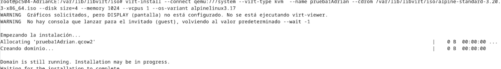

# creacionMV-KVM
apartado para ver como crear maquinas virtuales con KVM


# Index

- 1.Crear maquina con virt-manager
- 2.Crear maquina linea de comandos
- 3.Crear maquina linea de comandos con fichero xml
- 4.Modificar maquina


# 1. Crear maquina con virt-manager

Simplemente abrimos virt-manager y le damos a crear nueva maquina virtual, seguimos los pasos y ya tendremos nuestra maquina creada.De manera grafica es muy sencillo.

# 2. Crear maquina linea de comandos

Para crear una maquina virtual con la linea de comandos usaremos el comando virt-install, con la siguiente información:
    
    - Nombre de la maquina: --name
    - Tipo de virtualizacion: --virt-type kvm
    - ISO de instalación: --cdrom
    - Variante de la maquina: --os-variant (para saber las variantes disponibles usar el comando osinfo-query os)
    - Tamaño de la memoria RAM: --memory
    - Numero de CPUs: --vcpus
    - Tamaño del disco duro: --disk size (se creara con la imagen del disco duro en /var/lib/libvirt/images)
**_NOTA:_** Debemos tener la ISO en el directorio /var/lib/libvirt/iso (creamos el directorio)

**_NOTA:_** Para ver todas las opciones disponibles usar el comando virt-install --help


OPCIONES MAS UTILIZADAS:

- --connect : Conectar a un hipervisor
- --name : Nombre de la maquina
- --memory : Tamaño de la memoria RAM
- --disk : Tamaño del disco duro
- --vcpus : Numero de CPUs
- -c : ISO de instalación
- --vnc : Conexión VNC
- --os-variant : Variante de la maquina
- --network : Conexión de red
- --noautoconsole : No abrir la consola de la maquina
- --hvm : Habilitar la virtualización completa
- --keymap : Teclado

Tambien podemos utilizar `virt-install --help` para ver todas las opciones disponibles.

---

### 2.1  EJEMPLOS

- Crear una maquina llamada prueba , con una ISO alpine(variante alpine3.17) , 1GB de RAM, 1 CPU y 4GB de disco y 1 vcpu.(no indicamos la red porque se conectará a la default)

```bash	
virt-install --connect qemu:///system --virt-type kvm --name prueba --cdrom /var/lib/libvirt/iso/alpine-virt-3.17.0-x86_64.iso --os-variant alpine3.17 --memory 1024 --vcpus 1 --disk size=4
``` 
NOTA: si despues quiere seguir con la instalación de alpine, ejecitar setup-alpine




### 2.2 COMPROBACIONES

- Comprobar que la maquina esta corriendo

```bash
virsh list --all
```
- Acceder al terminal de una maquina

```bash
virt-viewer nombre_maquina
```

- La maquina se almacenará en /var/lib/libvirt/images
```bash
virsh domblklist nombre_maquina
```
- Apagar una maquina

```bash
virsh shutdown nombre_maquina
```

- Info de la maquina

```bash
virsh dominfo nombre_maquina
```
- Encender una maquina
```bash
virsh start nombre_maquina
```
---

Imagina que quieres redimensionar el disco de la maquina, para ello debemos apagar la maquina y redimensionar el disco con el siguiente comando:

```bash
ls -l /var/lib/libvirt/images/nombre_maquina.qcow2
qemu-img resize /var/lib/libvirt/images/nombre_maquina.qcow2 +2G
# cambiar el nombre de la maquina por el nombre de TU maquina
qemu-img info /var/lib/libvirt/images/nombre_maquina.qcow2
```

OTRAS COMANDOS UTILIZADS:


